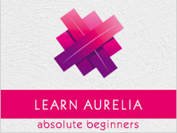

```
Roberto Nogueira  
BSd EE, MSd CE
Solution Integrator Experienced - Certified by Ericsson
```
# Tutorialspoint Aurelia



**About This Tutorial**

This is to grasp rapidly the language and its concepts.

[Aurelia Tutorial](https://www.tutorialspoint.com/aurelia/index.htm)

#### Topics
```
Aurelia Tutorial
[x] Home
[x] Overview
[x] Environment Setup
[ ] First Application
[ ] Components
[ ] Component Lifecycle
[ ] Custom Elements
[ ] Dependency Injections
[ ] Configuration
[ ] Plugins
[ ] Data Binding
[ ] Binding Behavior
[ ] Converters
[ ] Events
[ ] Event Aggregator
[ ] Forms
[ ] HTTP
[ ] Refs
[ ] Routing
[ ] History
[ ] Animations
[ ] Dialog
[ ] Localization
[ ] Tools
[ ] Bundling
[ ] Debugging
[ ] Community
[ ] Best Practices
Aurelia Useful Resources
[ ] Quick Guide
[ ] Useful Resources
[ ] Discussion
Selected Reading
[ ] Developer's Best Practices
[ ] Questions and Answers
[ ] Effective Resume Writing
[ ] HR Interview Questions
[ ] Computer Glossary
[ ] Who is Who
```

